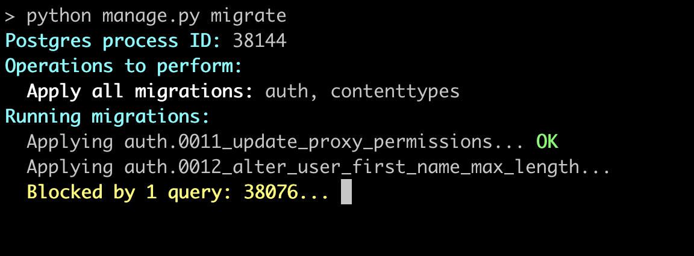

# Manually Terminating Blocking Queries

If it's not desirable to automatically terminate queries, you can configure `django-pgmigrate` to show the blocking queries so that they can be manually handled.

Set `settings.PGMIGRATE_BLOCKING_ACTION` to `pgmigrate.Show` to configure this behavior. For example, in `settings.py`:

```python
import pgmigrate

PGMIGRATE_BLOCKING_ACTION = pgmigrate.Show
```

Here's an example of what it looks like:



In the above, a warning message is printed when blocking activities are found. The Postgres process IDs of the activities are printed. Queries will remain blocked until they finish or are manually terminated.

## Manually Inspecting and Terminating Queries

`django-pgmigrate` automatically installs the [django-pgactivity](https://django-pgactivity.readthedocs.io) library, which makes it easy to view and terminate active queries.

Our original example printed a blocking ID of `38076`. We can run the following to show the duration of the query and the SQL:

    python manage.py pgactivity 38076

Output looks like this:

    38076 | 0:00:36 | IDLE_IN_TRANSACTION | None | select * from auth_user;

The second column is the duration of the query. The final column is the SQL. You can terminate the query with:

    python manage.py pgactivity 38076 --terminate

Once the query is terminated, migrations will continue.

!!! tip

    The `pgactivity` command can take multiple process IDs. These can be directly copied from the output of the `pgmigrate` command.

## Adding Application Context to Queries

The [django-pgactivity](https://django-pgactivity.readthedocs.io) library comes with middleware to automatically annotate the URL that issued the SQL statement, adding more information to help you understand where queries originate. Add `pgactivity.middleware.ActivityMiddleware` to `settings.MIDDLEWARE`, and `python manage.py pgactivity` will also show the application context in the results.

Once configured, our example output from above would look like this:

    38076 | 0:00:36 | IDLE_IN_TRANSACTION | {'url': '/admin/', 'method': 'GET'} | select * from auth_user;

We recommend [reading the django-pgactivity docs](https://django-pgactivity.readthedocs.io) to learn more about how it works, along with learning how to add context to management commands and background tasks. The docs also explain how to configure the `pgactivity` command for other use cases.
